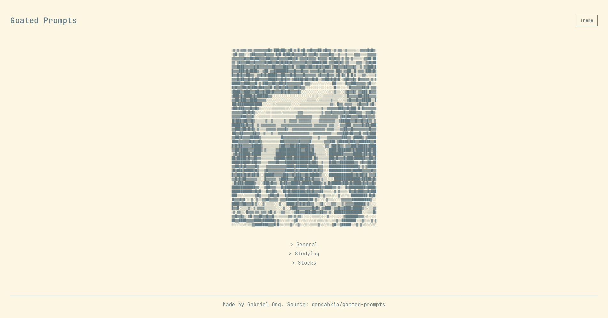

 

# `Goated Prompts`

Simple Web App with the prompts I use.

## Stack

* *Frontend*: [HTML](https://developer.mozilla.org/en-US/docs/Web/HTML), [CSS](https://developer.mozilla.org/en-US/docs/Web/CSS), [JavaScript](https://developer.mozilla.org/en-US/docs/Web/JavaScript), [Github Pages](https://pages.github.com/)
* *Backend*: [Python](https://www.python.org/)
* *Workflow*: [Github Actions](https://github.com/features/actions), [Google Cloud Console](https://console.cloud.google.com/), [Google Drive API](https://console.cloud.google.com/apis/library/drive.googleapis.com?hl=en-GB), [Google Sheets API](https://developers.google.com/workspace/sheets/api/guides/concepts)

## Screenshot

